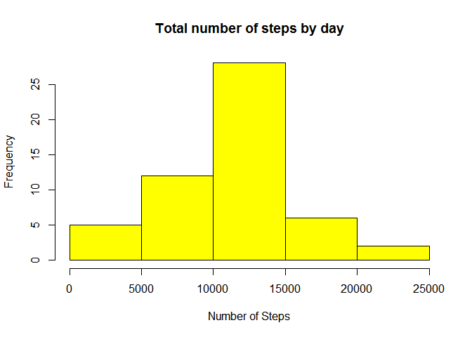
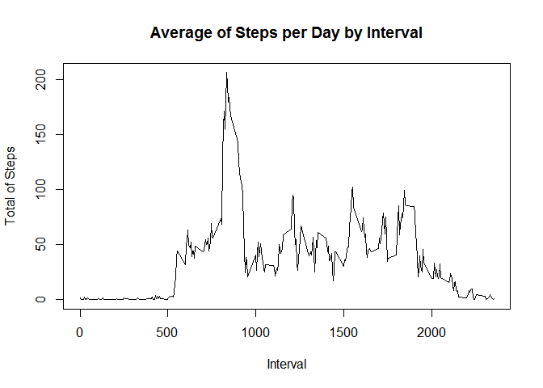
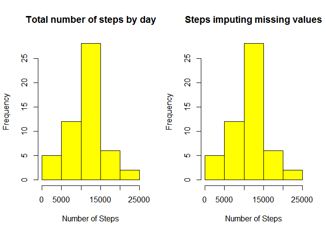
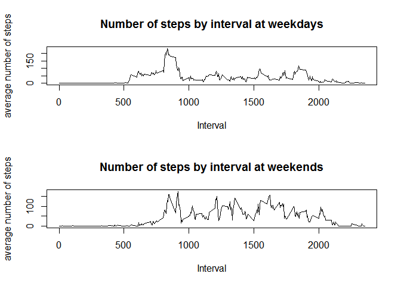

Loading and preprocessing the data
----------------------------------

In first place, we need to read the data and save it in a data frame

    data <- read.csv("activity.csv")

In this case we are not going to do any preproccesign of the data.

What is mean total number of steps taken per day?
-------------------------------------------------

The next step that we have to do is to calculate, for each day, the
total number of steps

    steps_day <- aggregate(steps ~ date, data, sum)
    steps <- steps_day$steps

Now we make a histogram of the total number of steps taken each day

    hist(steps, main = "Total number of steps by day", col="yellow", xlab="Number of Steps")

<!-- -->

We can now calculate the median and the mean of steps per day easily

    mean_steps <- mean(steps)
    median_steps <- median(steps)

The mean of total number of steps taken each day is 1.076618910^{4}. The
median of total number of steps taken each day is 10765.

What is the average daily activity pattern?
-------------------------------------------

The first thing that we have to do in order to answer this question is
to calculate the mean of steps by interval throug all the days.

    steps_interval <- aggregate(steps ~ interval, data, mean)

Now we plot the average number of steps per as a function of the
interval.

    steps3 <- steps_interval$steps
    interval <- steps_interval$interval
    plot(interval, steps3, type="l", xlab="Interval", ylab="Total of Steps", main="Average of Steps per Day by Interval")

<!-- -->

Now we calculate the 5-minute interval which contains the maximum number
of steps on average across all the days in the dataset. For this purpose
we first extract the index of the maximum of steps vector and after we
use that index for extract the correspondent interval of interval
vector.

    index <- which.max(steps3)
    interval_max <- interval[index]

The 5-minute interval which contains the maximum number of steps on
average across all the days is 835

Imputing missing values
-----------------------

Firstly, we calculate the number of missing values in our data set, i.e,
the number of cases that are not complete observations.

    number_missing_values <- sum(!complete.cases(data))

The total number of missing values in our data set is 2304

We can observe for which of the columns in our data frame there are
missing values

The total number of missing steps is 2304. The total number of missing
dates is 0. The total number of missing intervals is 0.

Therefore, we have to input the missing values for steps. We will do it
simply assigning the mean of steps.

    data_new <- data
    data_new$steps[is.na(data_new$steps)] <- mean(data$steps)

Now we calculate the total number of steps per day in the same way that
we have done in the first question.

    steps_day2 <- aggregate(steps ~ date, data_new, sum)
    steps2 <- steps_day2$steps

Now we make the new histogram and plot it beside to the histogram
plotted in the first question

    par(mfrow = c(1,2))

    hist(steps, main = "Total number of steps by day", col="yellow", xlab="Number of Steps")

    hist(steps2, main = "Steps imputing missing values", col="yellow", xlab="Number of Steps")

<!-- -->

Now we recalculate the values of mean and median

    mean_steps2 <- mean(steps2)
    median_steps2 <- median(steps2)
    difference_means <- mean_steps2 - mean_steps 
    difference_medians <- median_steps2 - median_steps 

The mean of total number of steps taken each day is 1.076618910^{4}. The
median of total number of steps taken each day is 1.076510^{4}.

The difference between this mean and the mean calculated in the first
question is 0.

The difference between this median and the median calculated in the
first question is 0.

Are there differences in activity patterns between weekdays and weekends?
-------------------------------------------------------------------------

We are going to create a new factor variable that indicates if the date
corresponds to a weekday or to a weekend day.

    weekdays <- c("lunes", "martes", "miércoles", "jueves", "viernes")
    new_date <- as.Date(data_new$date)
    type_day<- as.factor(ifelse(is.element(weekdays(new_date),weekdays), "Weekday", "Weekend"))
    data_new$type_day <- type_day

Note: We have written the weekdays in Spanish. (lunes = Monday, martes =
Thursday, miercoles = Wednesday, jueves = Thuesday and viernes = Friday)

Now we separate the data into weekdays and weekend days.

    data_weekdays <- data_new[data_new$type_day == "Weekday",]
    data_weekends <- data_new[data_new$type_day == "Weekend",]

Now we calculate the average number of steps per interval across all
days in the same way that we have done in previous questions, for
weekdays as well as weekend days.

    steps_interval_weekdays <- aggregate(steps ~ interval,data_weekdays,mean)
    steps_interval_weekends <- aggregate(steps ~ interval,data_weekends,mean)

Finally, we make two plots showing the average number of steps per
interval, for weekdays and for weekend days.

    interval_weekdays <- steps_interval_weekdays$interval
    steps_weekdays <- steps_interval_weekdays$steps
    interval_weekends <- steps_interval_weekends$interval
    steps_weekends <- steps_interval_weekends$steps

    par(mfrow = c(2,1))

    plot(x = interval_weekdays,xlab = "Interval", y = steps_weekdays, ylab = "average number of steps" ,type ="l",main = "Number of steps by interval at weekdays")

    plot(x = interval_weekends, xlab = "Interval", y = steps_weekends, ylab = "average number of steps" ,type ="l",main = "Number of steps by interval at weekends")

<!-- -->
